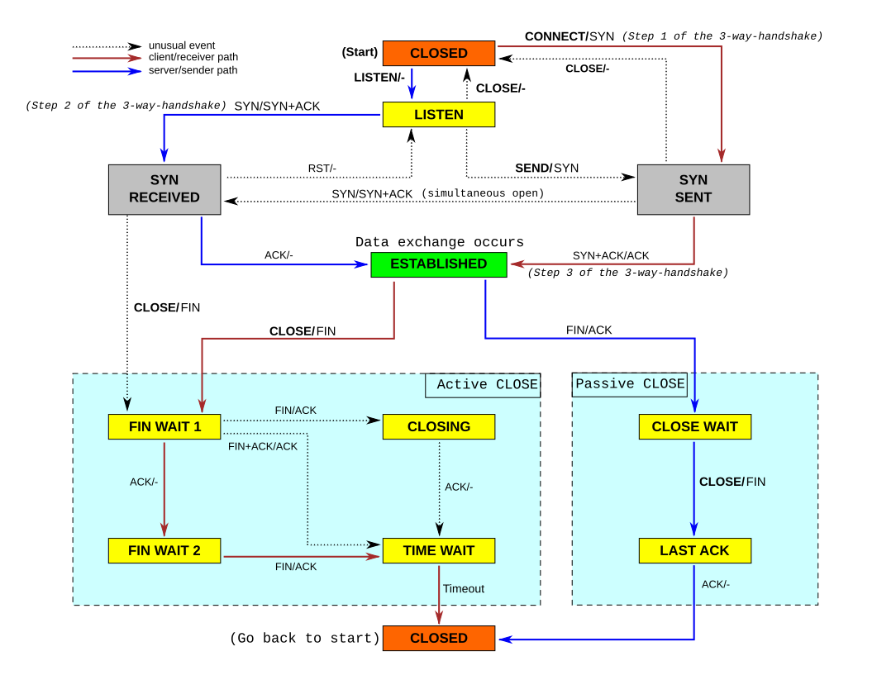

# Network Internship Project

C++ packet-analysis work done as a software-engineering internship at **Mahsan**.

This repository has two independent phases with two diffrent goals.

| Part | Topic | State |
| --- | --- | --- |
| [`P2/`](P2/) | Transactional-protocol analyzer: live capture → protocol classification → per-protocol statistics → Prometheus/Grafana dashboard | Main deliverable |
| [`P1/`](P1/) | Serialization study: JSON vs FlatBuffers vs Protobuf across three schema sizes | Smaller, self-contained |

> **New here?** Start with [P2 architecture](#p2-architecture) below, then follow
> the [reading order](#suggested-reading-order). `P2/docs/` contains the original
> design write-ups.

---

## P2 architecture

The goal was a single number per protocol: **transaction success rate**. If a DNS
server, an HTTP origin, or a SIP peer is failing, the owner needs to see that. So the
system answers one question — *of the transactions that happened, how many succeeded?* —
and it has to answer it for live traffic stream, not a saved file.

### Pipeline

```
 ┌──────────────┐
 │ PacketCapture│   libpcap: offline .pcap/.pcapng file OR live interface + BPF filter
 │  (libpcap)   │   emits a Binary { uint8_t* data, uint16_t length }
 └──────┬───────┘
        │
        ▼
   SafeQueue<Binary>                     bounded hand-off, condvar + shutdown flag
        │
        ▼
 ┌──────────────────┐
 │ dispatcher thread│   PacketUtils::flowHash(packet)  ──► 5-tuple hash
 └────────┬─────────┘
          │  analyzerQs[ hash % N ]
          ▼
 ┌────────────────────────────────────────────┐
 │ N analyzer threads, one Reporter each      │
 │                                            │
 │  Reporter                                  │
 │   ├─ PacketUtils   nDPI → DNS/HTTP/SIP/NONE│
 │   ├─ DnsReporter   transaction ID pairing  │
 │   ├─ HttpReporter  request/response pairing│
 │   └─ SipReporter   Call-ID pairing          │
 └────────────────────────────────────────────┘

 ┌────────────────────────────────────────────┐
 │ Transport layer (separate, per-flow)       │
 │  TcpReporter  state machine + reassembly   │
 │  SctpReporter association + stream reassembly
 └────────────────────────────────────────────┘
        │
        ▼   atomic counters in Report structs
 ┌──────────────────┐   scrape    ┌─────────────┐
 │ prometheus-cpp   │ ──────────► │  :8080      │
 └──────────────────┘             └──────┬──────┘
                                          ▼
                              Prometheus ──► Grafana
                              (prometheus.yml / dashboard.json)
```

### The two decisions worth understanding

**1. Flow-hash sharding instead of locking.**
The obvious way to scale this is one shared reporter guarded by a mutex. Instead,
`PacketUtils::flowHash()` (`P2/src/PacketUtils.cpp`) hashes the packet's 5-tuple and the
dispatcher thread routes it to `analyzerQs[hash % N]`. Every packet belonging to a given
flow therefore lands on the *same* analyzer thread, which means each reporter's flow
state is thread-local and the hot path needs no locks at all. The trade-off is that flow
state is spread across N reporters rather than centralized — aggregation happens at read
time through the atomic counters.

**2. Hand-parsing headers instead of delegating.**
PcapPlusPlus can parse DNS/SIP/HTTP. The first implementation was using it, then
rolled back in favour of reading the needed fields directly out of the byte buffer. The
reasoning, including the two approaches that were tried and discarded, is written up in
[`P2/docs/P2-2.md`](P2/docs/P2-2.md). The short version: for a tool that only needs two
or three fields per packet, byte-level parsing avoids building a full object model per
packet, and it keeps the dependency surface small.

PcapPlusPlus is still used — in the **tests**, to read capture files and build packets
easily.

### Transaction detection, per protocol

All three transaction reporters share a shape: keep a set of in-flight requests, and when
a response arrives, look up whether it belongs to a request you saw.

| Protocol | Correlation key | Success criterion | Source |
| --- | --- | --- | --- |
| DNS | 16-bit transaction ID | `rcode == 0` | [`P2/src/DnsReporter.cpp`](P2/src/DnsReporter.cpp) |
| HTTP | TCP ack number of the request | status class judged successful | [`P2/src/HttpReporter.cpp`](P2/src/HttpReporter.cpp) |
| SIP | `Call-ID` header | final `2xx` for the call | [`P2/src/SipReporter.cpp`](P2/src/SipReporter.cpp) |

`TcpReporter` and `SctpReporter` sit a layer lower — they track connections/associations
through a state machine and reassemble payloads.

### TCP state machine

`TcpReporter` advances each flow through a bitmask state (`P2/3rdparty/TcpNeeds.h`):

```
STATE_NONE ──SYN──► STATE_SYN_SENT ──SYN|ACK──► STATE_SYN_ACKED ──ACK──► STATE_ESTABLISHED
                                                                          │
                                            ┌──FIN─────────────────────┤
                                            ▼                          ▼
                                       STATE_FIN_SEEN             STATE_CLOSED
                                            │
                                       RST ──► STATE_RST_SEEN
```



Payload is reassembled per flow into a sequence-offset-keyed map, so segments are placed
by their TCP sequence number rather than by arrival order. `SctpReporter` does the
equivalent for SCTP associations, tracking verification tags and reassembling per stream
by stream sequence number.

---

## Building P2

Tested on Ubuntu 24.04, C++17. Dependencies come from [Conan](https://conan.io);
nDPI is built from source because it is not packaged.

### 1. nDPI (must be installed before CMake, or configure fails)

```bash
sudo apt-get install -y build-essential autoconf automake libtool m4 pkg-config \
                       libpcap-dev libjson-c-dev libpcre2-dev

git clone https://github.com/ntop/nDPI.git
cd nDPI && ./autogen.sh
./configure --prefix=/usr/local/
make -j"$(nproc)" && sudo make install && sudo ldconfig
```

`P2/CMakeLists.txt` looks for `ndpi_api.h` under `/usr/local/include/ndpi` and hard-fails
with a clear message if it is missing. Verify with `ls /usr/local/include/ndpi/`.

### 2. Conan packages + build

```bash
cd P2
pipx install --force conan && pipx ensurepath
conan profile detect

conan install . --output-folder=build --build=missing

cd build
cmake .. -DCMAKE_BUILD_TYPE=Release
cmake --build . -j"$(nproc)"
ctest --output-on-failure
```

Conan pulls in `gtest`, `pcapplusplus`, `cpp-httplib`, `prometheus-cpp`, `flex`. Note
that `P2/install_Vactions.sh` performs steps 2–3 in one go; it assumes nDPI is already
present.

Coverage is available via `-DENABLE_COVERAGE=ON`, then:

```bash
gcovr -r .. --exclude 'tests/*' --exclude 'P2/build/*'
```

### 3. Run

```bash
sudo ./statistics [report_interval] [interface]
```

Reporting and the TCP/SCTP reassembly dump are the useful knobs. Reading from a file
instead of a live interface is a one-line edit to `capture_interface` in
`P2/src/statistics.cpp` — see the commented example there:

```cpp
vector<pair<bool,string>> capture_interface = {{false, "wlp0s20f3"}};          // live
// vector<pair<bool,string>> capture_interface = {{true, "samples/htmldns.pcapng"}}; // file
```

Live capture needs root. Metrics are exposed on `:8080`; change `Exposer` in
`statistics.cpp` if that port is taken.

### 4. Dashboard

```bash
./prometheus --config.file=prometheus.yml   # scrapes localhost:8080 every 2s
sudo systemctl start grafana-server         # http://localhost:3000
```

`P2/dashboard.json` is an importable Grafana dashboard.

---

## Tests

Seven GoogleTest suites, registered with CTest. They run against the real captures in
`P2/samples/` rather than synthetic packets, and assert exact counters — the numbers are
derived from the captures, so a regression in parsing shows up as a changed expectation.

```
ctest --test-dir P2/build --output-on-failure
```

| Suite | What it pins down |
| --- | --- |
| `dns-tests`, `http-tests`, `sip-tests` | Transaction detection and success classification |
| `tcp-tests` | Connection state machine **and** reassembly verified by md5 of the reconstructed payload |
| `sctp-tests` | Association tracking and per-stream reassembly, verified by md5 |
| `utils-tests` | nDPI classification counts, `flowHash` stability |
| `capture-tests` | Offline file and live-interface capture |

Two of these are worth reading as examples of the intended testing style:

- **`ReassembleTcpDataCommingInShuffledOrder`** (`P2/tests/test_tcp.cpp`) shuffles the
  captured segments before feeding them in, then asserts the reassembled file still has
  the same md5. It tests reassembly against reordering, not just against a happy path.
- **`SampleCreatedSctpStatistics`** (`P2/tests/test_sctp.cpp`) documents its expected
  counts inline, including the distinction between *attempts* and *completed*
  associations.

`capture-tests` includes live-interface tests, gated behind `-DENABLE_INTERFACE_TESTS=ON`
so CI stays hermetic.

CI (`.github/workflows/cmake-single-platform.yml`) builds nDPI, configures, runs `ctest`
across Debug and Release, and additionally runs the suites under Valgrind.

---

## Suggested reading order

For someone new to the codebase:

1. [`P2/docs/P2-1.md`](P2/docs/P2-1.md) — what a DNS request/response pair actually looks
   like on the wire, captured and annotated. Start here; it makes the rest concrete.
2. [`P2/docs/P2-2.md`](P2/docs/P2-2.md) — the reporter design, including the two
   rejected approaches.
3. `P2/src/DnsReporter.cpp` — smallest complete example of the reporter pattern.
4. `P2/src/PacketUtils.cpp` → `P2/src/PacketAnalyzer.cpp` — how a raw `Binary` becomes a
   protocol verdict.
5. `P2/src/TcpReporter.cpp` — state machine and reassembly.
6. `P2/src/statistics.cpp` — threading model, flow-hash dispatch, Prometheus wiring.

`P2/README.md` is the **original assignment brief** that scoped this work. It is kept
because it explains why each piece exists; it is not current documentation.

---

## P1: serialization study

Three schemas of increasing complexity (flat → wider → repeated/nested), each serialized
three ways, to compare **size**, **schema-evolution effort**, and **access cost**.

Measured output sizes for the 10-record sample set:

| Schema | JSON | FlatBuffers | Protobuf |
| --- | --- | --- | --- |
| First | 2,806 B | 1,996 B | not measured |
| Second | 3,253 B | 2,288 B | not measured |
| Third | 5,127 B | 3,500 B | not measured |

JSON and FlatBuffers figures are the committed outputs in `P1/json/` and
`P1/flatbuffer/out/`. Protobuf binaries were not committed, so no size claim is made for
them here.

Findings: JSON is cheapest to change and readable but largest; FlatBuffers gave the
smallest output and allows zero-copy reads; Protobuf is compact but requires a
deserialization step before field access. See [`P1/README.md`](P1/README.md) for the
per-implementation walkthroughs and the caveats.

---

## Repository layout

```
├── P1/                          serialization study
│   ├── json/                    shared sample input (10 records × 3 schemas)
│   ├── flatbuffer/              flatc schemas + writers, outputs in out/
│   ├── protobuff/               protoc schemas + writers (Bazel)
│   └── Core/nlohmann/           vendored json.hpp used by the flatbuffer writers
├── P2/                          packet analyzer (main deliverable)
│   ├── include/                 public headers
│   ├── src/                     reporters, capture, statistics executable
│   ├── tests/                   seven GoogleTest suites
│   ├── 3rdparty/                shared constants and packet-layout headers
│   ├── samples/                 real captures used by the tests
│   ├── docs/                    design write-ups, numbered by assignment issue
│   ├── prometheus.yml           scrape config
│   └── dashboard.json           Grafana dashboard
├── prototest/, flattest/        minimal single-file examples of each serializer
├── docs/                        original P1 brief + reference material
└── Tcp_state_diagram_fixed_new.svg
```

---

## Known limitations

Documented rather than hidden, since they are the natural next tasks:

- **Ethernet-only, no VLAN.** `PacketUtils::flowHash` reads fixed offsets assuming a
  14-byte Ethernet header and an IPv4 header with no options. 802.1Q-tagged or
  IP-header-with-options traffic will hash incorrectly. The same assumption appears in the
  TCP/SCTP header walks.
- **IPv4 path is the well-tested one.** IPv6 parsing exists in `extractTcpInfo` and
  `flowHash` and is exercised by the merged v4/v6 tests, but the sample corpus is
  overwhelmingly IPv4.
- **`statistics.cpp` argument handling.** `argv[2]` is parsed into `interface` but the
  capture list is still hardcoded, so the command-line interface name is ignored — edit
  `capture_interface` directly (commented example included) or wire the argument through.
- **`DnsReporter` counter timing.** On a completed transaction it decrements then
  re-increments `failedDns`, so a concurrent scraper can briefly observe an intermediate
  value. Harmless for a rate, but it is why `failed*` is exported as a gauge.
- **Large captures are committed as-is.** `P2/samples/capture.pcapng` is ~22 MB and
  `htmldns.pcapng` ~4 MB. Fine at this size; if the corpus grows, Git LFS is the fix.
- **P1 is not wired into a build system.** Each writer is compiled by hand or via Bazel;
  there is no top-level CMake for P1 and no benchmark harness, so the P1 conclusions rest
  on output size rather than measured throughput.